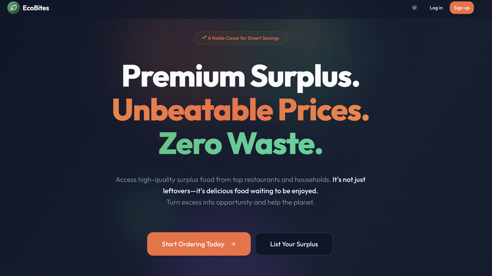
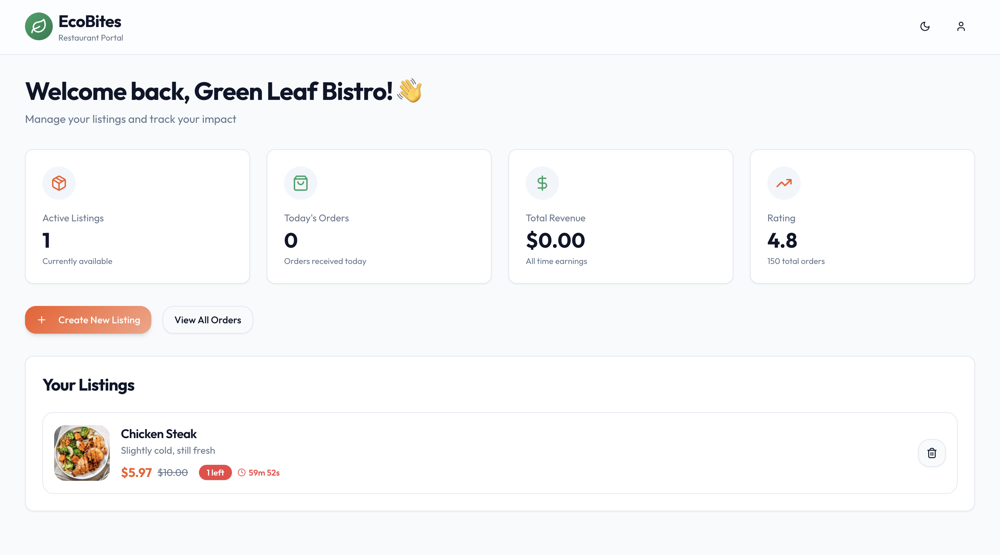
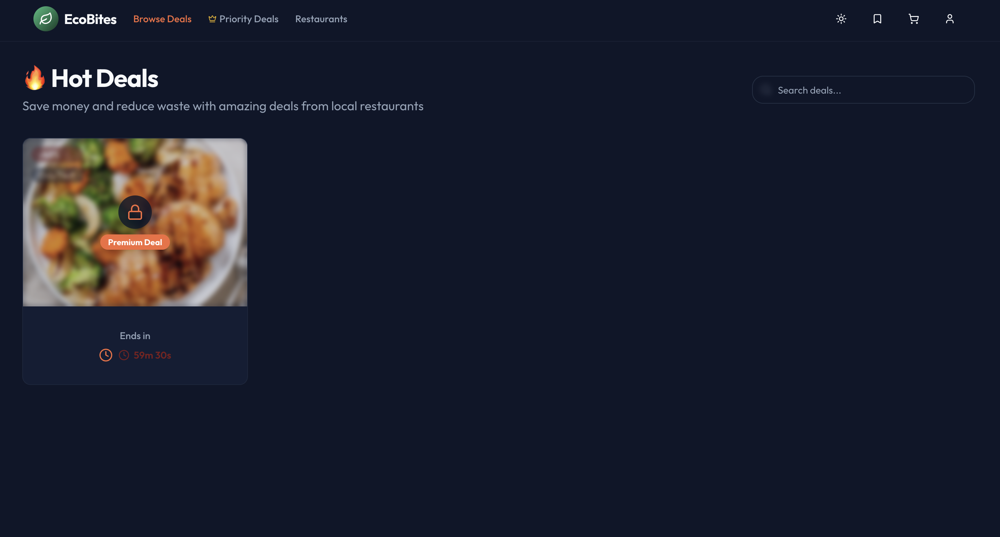
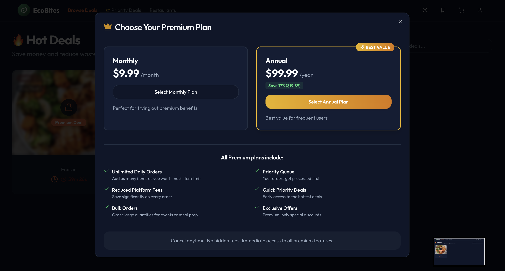
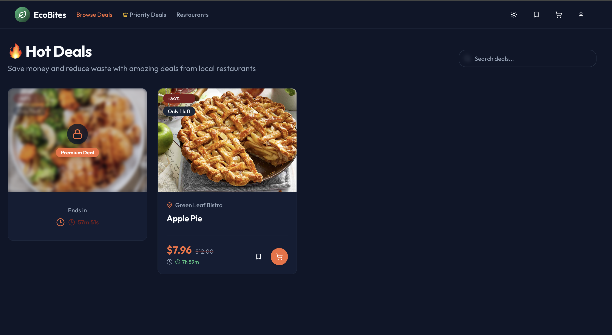
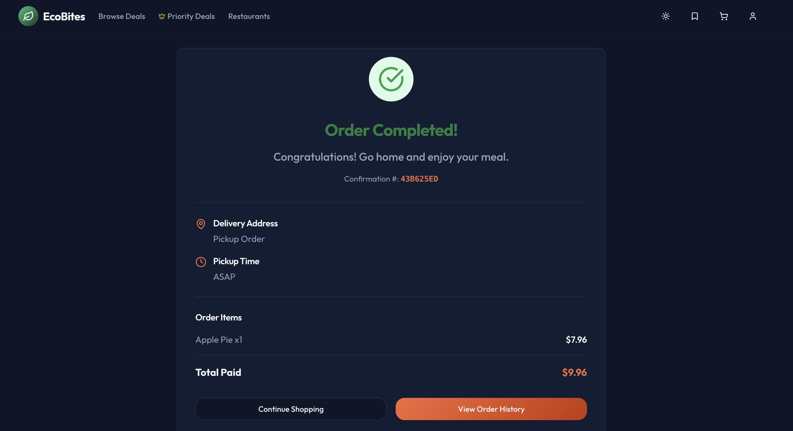
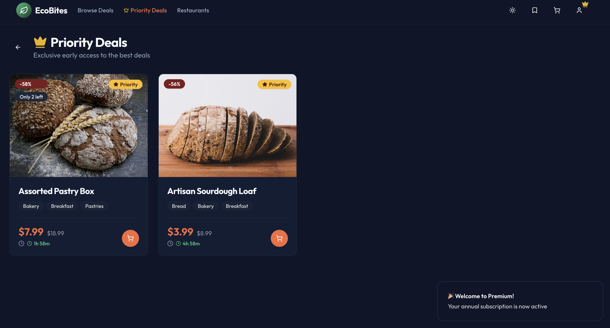

# EcoBites

EcoBites is a sustainable food marketplace application designed to reduce food waste by connecting users with restaurants offering surplus food at discounted prices. The platform consists of two main applications: a User App for browsing and ordering, and a Restaurant App for managing listings and tracking performance.

## Features

*   **User App:**
    *   Browse food listings from local restaurants.
    *   Place orders for surplus food.
    *   Track order status.
    *   View order history.
*   **Restaurant App:**
    *   Create and manage food listings.
    *   Real-time order management.
    *   Dashboard with revenue and order analytics.
    *   Profile management.
*   **Shared:**
    *   Authentication and role-based access.
    *   Responsive design for mobile and desktop.

## Tech Stack

### Frontend
*   **Framework:** [React](https://react.dev/) with [Vite](https://vitejs.dev/)
*   **Language:** [TypeScript](https://www.typescriptlang.org/)
*   **Styling:** [Tailwind CSS](https://tailwindcss.com/)
*   **UI Components:** [Radix UI](https://www.radix-ui.com/) / Shadcn UI
*   **State Management & Data Fetching:** [React Query (@tanstack/react-query)](https://tanstack.com/query/latest)
*   **Routing:** [React Router DOM](https://reactrouter.com/)
*   **Forms:** [React Hook Form](https://react-hook-form.com/) with [Zod](https://zod.dev/) validation
*   **Charts:** [Recharts](https://recharts.org/)
*   **Icons:** [Lucide React](https://lucide.dev/)
*   **HTTP Client:** [Axios](https://axios-http.com/)

### Backend
*   **Runtime:** [Node.js](https://nodejs.org/)
*   **Framework:** [Express.js](https://expressjs.com/)
*   **Database:** [PostgreSQL](https://www.postgresql.org/)
*   **ORM/Querying:** `pg` (node-postgres)
*   **File Uploads:** [Multer](https://github.com/expressjs/multer)

### Infrastructure
*   **Containerization:** [Docker](https://www.docker.com/) (for the database)

## Setup Steps

Follow these steps to get the project running locally.

### Prerequisites
*   Node.js (v18+ recommended)
*   npm or yarn
*   Docker and Docker Compose

### 1. Database Setup
The application uses PostgreSQL. We use Docker Compose to spin up a local instance.

1.  Navigate to the backend directory:
    ```bash
    cd eco-backend
    ```
2.  Start the database container:
    ```bash
    docker-compose up -d
    ```
    This will start a PostgreSQL instance on port 5432 with the credentials defined in `docker-compose.yml`.

### 2. Backend Setup
1.  Ensure you are in the `eco-backend` directory.
2.  Install dependencies:
    ```bash
    npm install
    ```
3.  Start the backend server:
    ```bash
    npm run dev
    ```
    The server will start (typically on port 3000 or as defined in your environment).

    To seed the database with sample data, run:
    ```bash
    npm run seed
    ```

### 3. Frontend Setup
1.  Open a new terminal and navigate to the frontend directory:
    ```bash
    cd eco-frontend
    ```
2.  Install dependencies:
    ```bash
    npm install
    ```
3.  Start the development server:
    ```bash
    npm run dev
    ```
4.  Open your browser and navigate to the URL shown in the terminal 
## Assumptions & Bonus Features

*   **Monorepo Structure:** The project is structured with separate directories for frontend (`eco-frontend`) and backend (`eco-backend`) within a single repository for easier management.
*   **Dockerized Database:** A `docker-compose.yml` is provided to easily spin up the required PostgreSQL database without manual installation/configuration on the host machine.
*   **Modern UI/UX:** The frontend leverages modern libraries like Radix UI and Tailwind CSS to provide an accessible and responsive user interface.
*   **Type Safety:** TypeScript is used in the frontend to ensure type safety and better developer experience.

## Screenshots

| | |
|:-------------------------:|:-------------------------:|
|  |  |
|  |  |
|  |  |
|  | |

### Demo Video
[Watch the demo video](screenshots/demo.mp4)

## Note

Netlify upload couldn't be set up because I have a project running there - [lucidmeets.com](https://lucidmeets.com) with cloud run for it. Setting up a frontend without a working backend also didn't make sense, but you can check out [www.lucidmeets.com](https://lucidmeets.com) which has authentication and advanced UI/UX features (an app I have created). EcoGrabs, had severe time contraints and whatever was done was done in one day. A basic implmentation of a bigger idea was created. 


